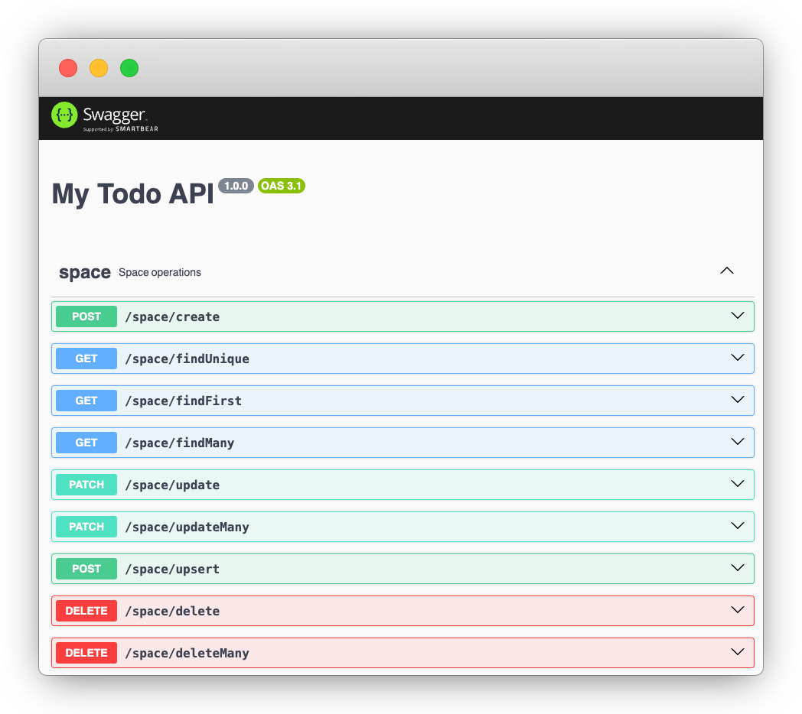

# Generating API Documentation

An API is only complete when documented. Similar to the API itself, the documentation can also be derived from the ZModel.

In [Part II](/docs/the-complete-guide/part2/) of the guide, we've learned how to use plugins. ZenStack ships the [@zenstackhq/openapi](/docs/reference/plugins/openapi) plugin to generate [OpenAPI](https://www.openapis.org/) specs from the ZModel schema. Like the API handlers, the openapi plugin also supports two flavors: "rpc" and "rest".

Once the documentation is generated, it's easy to render it using tools like [Swagger UI](https://swagger.io/tools/swagger-ui/) and [Redocly](https://redocly.com/).

### 🛠️ Serving Documentation For Our Todo API

Let's generate an OpenAPI spec for our Todo API and serve it using Swagger UI.

#### 1. Installing Dependencies

```bash
npm install --save-dev @zenstackhq/openapi
npm install swagger-ui-express
npm install -D @types/swagger-ui-express
```

#### 2. Adding OpenAPI Plugin to ZModel

```zmodel title="schema.zmodel"
plugin openapi {
    provider = "@zenstackhq/openapi"
    output = "todo-api.json"
    title = "My Todo API"
    version = "1.0.0"
    flavor = "rpc"
}
```

Rerun generation:

```bash
npx zenstack generate
```

The `todo-api.json` file should be generated in the project root.

#### 3. Serving the OpenAPI Spec

Add the following code to `main.ts`:

```ts title="main.ts"
import swaggerUI from 'swagger-ui-express';
app.use(
    '/api/docs',
    swaggerUI.serve,
    swaggerUI.setup(require('./todo-api.json'))
);
```

Now, you can visit the documentation at [http://localhost:3000/api/docs](http://localhost:3000/api/docs) in a browser.


